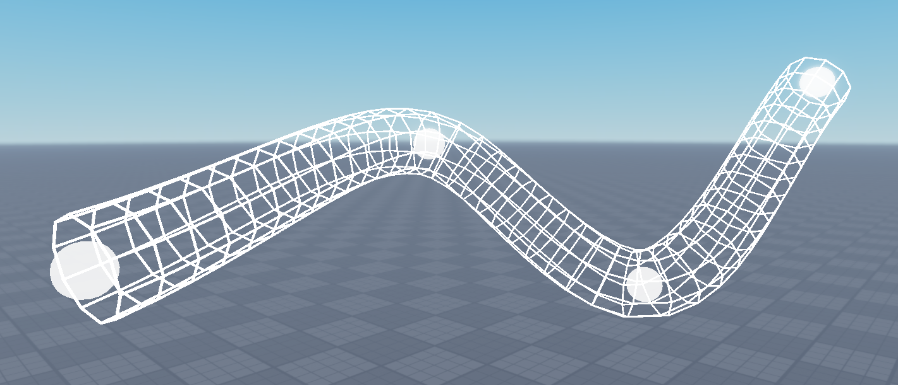

# CatRom
Creates [Catmull-Rom splines](https://en.wikipedia.org/wiki/Centripetal_Catmull%E2%80%93Rom_spline).

The Catmull-Rom spline (CatRom) is a cousin of the popular Bézier curve. One important difference between them is that CatRoms chain together easier. Like a cubic Bézier, a CatRom is defined by 4 points. Using the last 3 points from one CatRom as the first 3 points of another allows for a seamless transition between the two.

## How to use
This module has 2 objects: **Spline** and **Chain**.

A Spline is a CatRom defined by 4 points, an *alpha*, and a *tension*. The alpha and tension are not defined well currently and will be renamed in later versions.

A Chain is a set of connected Splines defined by an array of points, an alpha, and a tension. The Chain constructor will handle all of the Spline creation for you.

Note that the alpha and tension cannot be changed after a Spline or Chain has been created. This may change.

## Constructors
The constructors will likely be changed in the future to instead take in a dictionary of settings.
### **`CatRom.Spline.new(p0, p1, p2, p3, alpha, tension)`**
### **`CatRom.Chain.new(points, alpha, tension)`**

## Methods
Splines and Chains share the same methods, so while I have chosen to write "Chain" here, all of these apply to Splines as well.
Note that each method listed also has a `SolveUniform` counterpart. The uniform counterparts re-parameterize the inputs such that they correspond to a percent length along the curve.
### **`Chain:SolvePosition(alpha: number)`**
### **`Chain:SolveCFrame(alpha: number)`**
### **`Chain:SolveRotCFrame(alpha: number)`**

### **`Chain:SolveVelocity(alpha: number)`**
### **`Chain:SolveAcceleration(alpha: number)`**

### **`Chain:SolveTangent(alpha: number)`**
### **`Chain:SolveNormal(alpha: number)`**
### **`Chain:SolveBinormal(alpha: number)`**
### **`Chain:SolveCurvature(alpha: number)`**
### **`Chain:SolveLength(a: number, b: number)`**